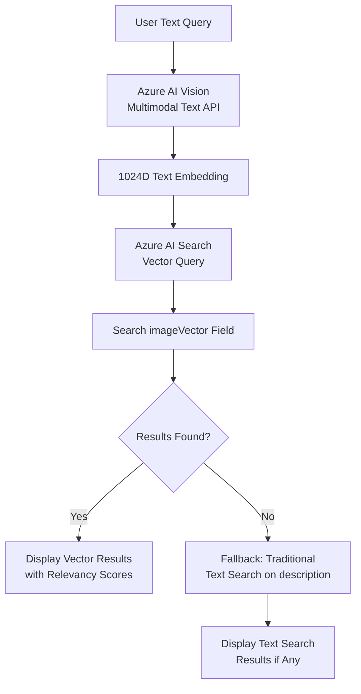
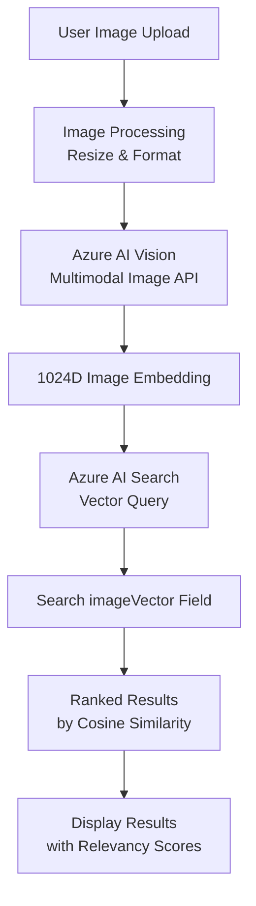
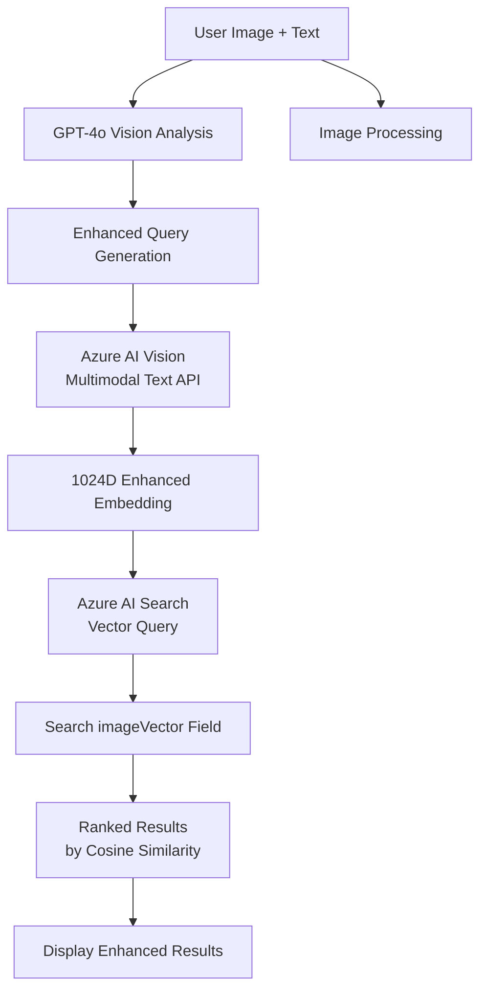
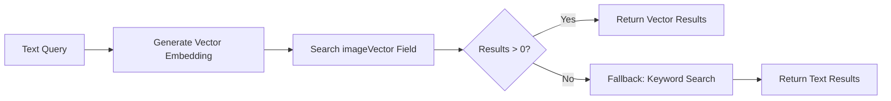
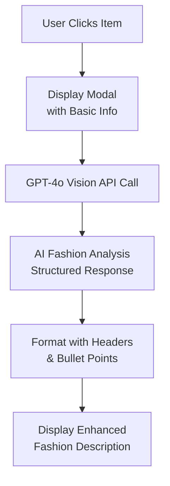
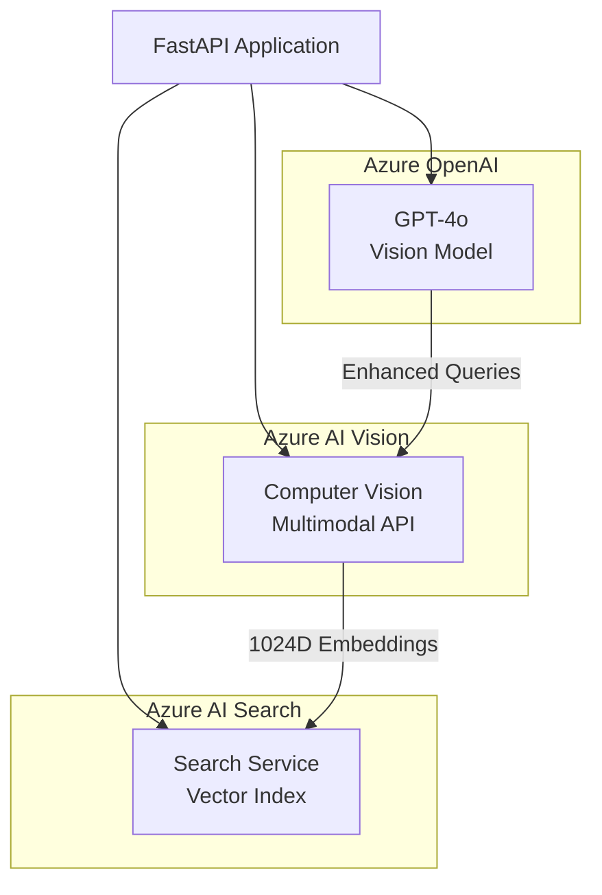
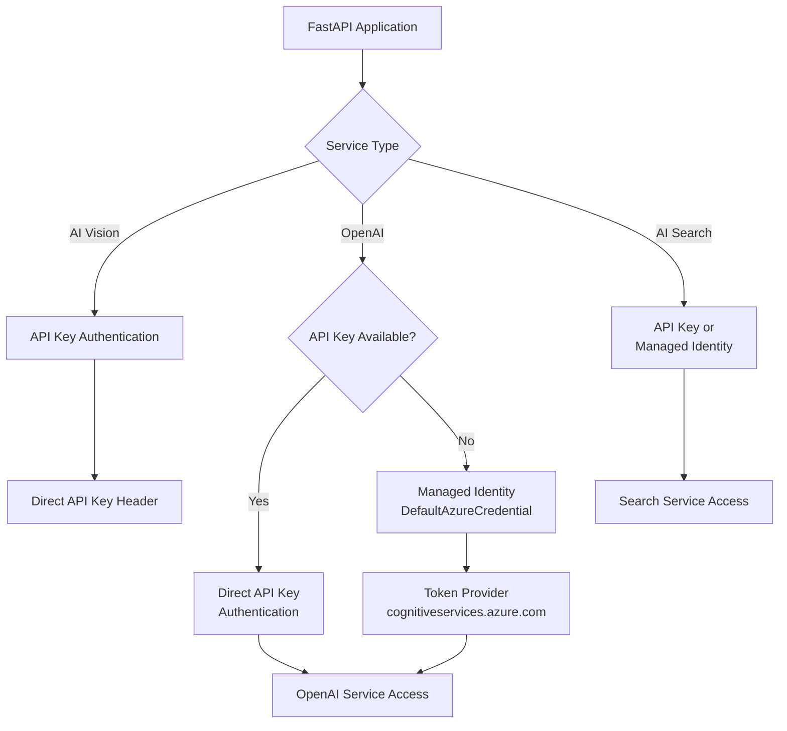

# Multimodal Apparel Search Application

A state-of-the-art web application that enables semantic search for apparel items using **Azure AI Vision multimodal embeddings**, supporting text input, image upload, or combined multimodal queries.

## 🏗️ Architecture Overview

This application implements three distinct search scenarios using Azure AI services, each optimized for different search patterns and user intents.

### Search Scenarios

| Scenario | Input | Primary Method | Fallback Method | Search Field |
|----------|-------|----------------|-----------------|--------------|
| **Text Search** | Natural language query | Vector Search (Azure AI Vision text embedding) | Traditional text search on `description` | `imageVector` |
| **Image Search** | Uploaded image | Vector Search (Azure AI Vision image embedding) | None | `imageVector` |
| **Multimodal Search** | Image + Text context | Vector Search (GPT-4o enhanced → text embedding) | None | `imageVector` |

> **Architecture Design**: All search modes use the `imageVector` field because Azure AI Vision's multimodal embeddings create semantically aligned vectors for both text and images in the same 1024-dimensional space, enabling true cross-modal similarity search. Text search includes a traditional keyword search fallback for edge cases.

---

## 📋 Technical Stack & Models

### Core Models Used

#### **Azure AI Vision Multimodal Embeddings API**
- **Model Version**: `2023-04-15` (multilingual support, 102 languages)
- **API Version**: `2024-02-01`
- **Vector Dimensions**: 1024
- **Purpose**: Generates unified embeddings for both text and images in the same semantic space

#### **Azure OpenAI GPT-4o**  
- **Deployment**: `gpt-4o`
- **API Version**: `2024-05-01-preview`
- **Purpose**: Vision analysis and enhanced query generation for multimodal scenarios

#### **Azure AI Search**
- **Search Algorithm**: Vector similarity search with cosine distance
- **Unified Vector Field**: All searches use `imageVector` field (1024D) for cross-modal compatibility
- **Fallback Strategy**: Text search includes traditional keyword search fallback on `description` field

---

## 🔄 Architecture Diagrams & Flows

### 1. **Text Search Flow (Hybrid Approach)**


**Primary Method:**
- `POST /computervision/retrieval:vectorizeText` → Vector search on `imageVector`

**Fallback Method:**
- Traditional keyword search on `description` field (if vector search returns no results)

### 2. **Image Search Flow**  


**Endpoints Used:**
- `POST /computervision/retrieval:vectorizeImage`
- Azure AI Search vector similarity

### 3. **Multimodal Search Flow**


**Endpoints Used:**
- Azure OpenAI GPT-4o Vision API
- `POST /computervision/retrieval:vectorizeText`
- Azure AI Search vector similarity on `imageVector`

---

## 🎯 Cross-Modal Vector Search Architecture

### **Unified Vector Space Benefits**

**Why All Searches Use `imageVector` Field:**
- **Semantic Alignment**: Azure AI Vision's multimodal embeddings ensure text and image vectors exist in the same semantic space
- **Cross-Modal Discovery**: Text queries can find visually similar items even if descriptions differ
- **Consistent Ranking**: All search modes use identical cosine similarity scoring
- **Simplified Index**: Single vector field reduces complexity and improves performance

### **Hybrid Text Search Strategy**


**Benefits:**
- **Primary**: Semantic understanding through vector similarity
- **Fallback**: Ensures no query returns empty results
- **Performance**: Vector search is typically faster and more accurate

---

## 🎯 Detailed Item View with AI Analysis

### GPT-4o Fashion Analysis Flow


**Generated Analysis Includes:**
- 🎨 **Visual Design** (colors, patterns, textures)
- ✨ **Style Statement** (fashion category, aesthetic)  
- 👔 **Versatility & Occasions** (use cases, styling)
- 🔥 **Standout Features** (unique details, quality)
- 💡 **Styling Tips** (pairing suggestions, target demographic)

---

## 🔑 Environment Variables

### Required Azure Services

| Variable | Service | Purpose | Example |
|----------|---------|---------|---------|
| `AZURE_COMPUTER_VISION_ENDPOINT` | **Computer Vision** | Multimodal embeddings API | `https://your-vision.cognitiveservices.azure.com/` |
| `AZURE_COMPUTER_VISION_API_KEY` | **Computer Vision** | API authentication | `your_api_key_here` |
| `AZURE_OPENAI_ENDPOINT` | **OpenAI** | GPT-4o vision analysis | `https://your-openai.openai.azure.com/` |
| `AZURE_OPENAI_API_KEY` | **OpenAI** | API authentication (optional, fallback to Managed Identity) | `your_openai_api_key_here` |
| `AZURE_OAI_DEPLOYMENT` | **OpenAI** | GPT-4o model deployment | `gpt-4o` |
| `AZURE_SEARCH_SERVICE_ENDPOINT` | **AI Search** | Vector search service | `https://your-search.search.windows.net` |
| `AZURE_SEARCH_INDEX_NAME` | **AI Search** | Target search index | `apparel-multimodal-index` |
| `AZURE_SEARCH_API_KEY` | **AI Search** | API authentication (optional, fallback to Managed Identity) | `your_search_api_key_here` |

### Azure Service Dependencies



---

## 🚀 Key Features

### 🔍 Three Search Modes
1. **Hybrid Text Search**: Vector search using multimodal text embeddings (primary) + keyword search fallback
2. **Pure Image Search**: Visual similarity using multimodal image embeddings  
3. **AI-Enhanced Multimodal**: GPT-4o analyzes image context to generate enhanced text queries for vector search

### 🎨 User Experience
- **Responsive Design**: Works on desktop, tablet, and mobile
- **Drag & Drop**: Easy image uploads with preview
- **Real-time AI Analysis**: GPT-4o generates detailed fashion descriptions on-demand
- **Structured Results**: Clean formatting with relevancy scores and detailed item analysis
- **Performance Optimized**: Async operations with proper error handling

## Prerequisites

- Python 3.8+
- Azure subscription with the following resources:
  - Azure AI Search service with a configured index
  - Azure Computer Vision service
  - Azure OpenAI service with GPT-4o deployment
  - Managed Identity configured for your hosting environment

## Quick Start

### 1. Environment Setup
```bash
# Clone/navigate to project directory
cd ecom-image-search-app

# Install dependencies
pip install -r requirements.txt
```

### 2. Configure Environment
Update your `.env` file with your Azure endpoints:
```env
AZURE_OPENAI_ENDPOINT=https://your-openai-endpoint.openai.azure.com/
AZURE_OAI_DEPLOYMENT=gpt-4o
AZURE_OPENAI_EMBEDDING_MODEL=text-embedding-ada-002
AZURE_COMPUTER_VISION_ENDPOINT=https://your-vision-endpoint.cognitiveservices.azure.com/
AZURE_SEARCH_SERVICE_ENDPOINT=https://your-search-endpoint.search.windows.net
AZURE_SEARCH_INDEX_NAME=your-index-name
AZURE_OAI_API_VERSION=2024-05-01-preview
```

### 3. Run Locally
```bash
# Start the development server
python main.py

# Or use uvicorn directly
uvicorn main:app --host 0.0.0.0 --port 8000 --reload
```

Visit `http://localhost:8000` to access the application.

---

## 🔧 Troubleshooting

### Common Issues and Solutions

#### Authentication Errors
```
Error: "Invalid API key" or "Authentication failed"
```
**Solution**: Verify your environment variables are correctly set:
```bash
# Check if environment variables are loaded (PowerShell)
echo $env:AZURE_COMPUTER_VISION_API_KEY
echo $env:AZURE_OPENAI_ENDPOINT
```

#### Embedding API Issues
```
Error: "multimodal embeddings not supported"
```
**Solution**: Ensure you're using the correct API version and region:
- API Version: `2023-04-15` or later
- Supported regions: East US, West Europe, Southeast Asia

#### Search Results Empty
```
No results returned despite valid query
```
**Solutions**:
1. Check if your search index has vector fields configured
2. Verify the vector field name matches your search queries  
3. Ensure embeddings are properly indexed in Azure AI Search

#### Performance Issues
- **Slow image processing**: Resize images to max 1024px before upload
- **Timeout errors**: Implement retry logic with exponential backoff
- **High latency**: Consider caching embeddings for frequently searched items

### Debug Mode
Enable verbose logging by setting:
```bash
$env:LOG_LEVEL = "DEBUG"  # PowerShell
```

---

## 📚 API Reference

### Search Endpoints

#### Image Search
```http
POST /search/image
Content-Type: multipart/form-data

Parameters:
- file: Image file (JPEG, PNG, WebP)
- count: Number of results (default: 10)
```

#### Text Search  
```http
POST /search/text
Content-Type: application/json

{
  "query": "blue cotton dress",
  "count": 10
}
```

#### Multimodal Search
```http
POST /search/multimodal
Content-Type: multipart/form-data

Parameters:
- file: Image file (optional)
- query: Text description (optional)
- count: Number of results (default: 10)
```

#### Enhanced Item Description
```http
GET /item/enhanced-description/{item_id}

Returns:
{
  "item_id": "123",
  "enhanced_description": "Formatted AI analysis...",
  "analysis_timestamp": "2024-01-01T10:00:00Z"
}
```

### Response Format
All search endpoints return:
```json
{
  "results": [
    {
      "id": "item_123",
      "title": "Product Name",
      "brand": "Brand Name", 
      "price": "$XX.XX",
      "image_url": "https://...",
      "relevancy_score": 0.85
    }
  ],
  "count": 10,
  "processing_time_ms": 245
}
```

---

## 🗄️ Azure AI Search Index Schema

### Required Index Fields

```json
{
  "fields": [
    {
      "name": "id", 
      "type": "Edm.String", 
      "key": true,
      "searchable": false,
      "retrievable": true
    },
    {
      "name": "description", 
      "type": "Edm.String", 
      "searchable": true,
      "retrievable": true
    },
    {
      "name": "img", 
      "type": "Edm.String",
      "searchable": false, 
      "retrievable": true
    },
    {
      "name": "price", 
      "type": "Edm.Double",
      "searchable": false,
      "retrievable": true
    },
    {
      "name": "descriptionVector", 
      "type": "Collection(Edm.Single)",
      "dimensions": 1024,
      "vectorSearchProfile": "default-vector-profile",
      "retrievable": false
    },
    {
      "name": "imageVector", 
      "type": "Collection(Edm.Single)",
      "dimensions": 1024,  
      "vectorSearchProfile": "default-vector-profile",
      "retrievable": false
    }
  ]
}
```

### Key Changes from Standard Implementation

- **Unified Vector Dimensions**: Both `descriptionVector` and `imageVector` use **1024 dimensions** (Azure AI Vision multimodal standard)
- **Multimodal Compatibility**: Embeddings generated by the same model ensure cross-modal semantic similarity
- **Optimized Retrieval**: Vector fields are not retrievable to improve query performance

---

## 🛠️ Setup Instructions

### 1. Prerequisites
- Python 3.8+
- Azure subscription with the following services:
  - **Azure AI Vision** (with multimodal embeddings support)
  - **Azure OpenAI** (with GPT-4o deployment)  
  - **Azure AI Search** (with vector search enabled)

### 2. Environment Configuration

Copy `.env.example` to `.env` and configure your endpoints:

```bash
cp .env.example .env
```

Update `.env` with your Azure resource details:
```bash
# Azure AI Vision (Multimodal Embeddings)
AZURE_COMPUTER_VISION_ENDPOINT=https://your-vision-resource.cognitiveservices.azure.com/
AZURE_COMPUTER_VISION_API_KEY=your_vision_api_key

# Azure OpenAI (GPT-4o Vision)  
AZURE_OPENAI_ENDPOINT=https://your-openai-resource.openai.azure.com/
AZURE_OAI_DEPLOYMENT=gpt-4o

# Azure AI Search (Vector Index)
AZURE_SEARCH_SERVICE_ENDPOINT=https://your-search-service.search.windows.net
AZURE_SEARCH_INDEX_NAME=your-multimodal-index
AZURE_SEARCH_API_KEY=your_search_api_key
```

### 3. Installation & Running

```bash
# Install dependencies
pip install -r requirements.txt

# Start development server  
python main.py

# Access application
open http://localhost:8000
```

---

## 🔐 Authentication & Security

### Azure Service Authentication

| Service | Authentication Method | Configuration |
|---------|----------------------|---------------|
| **Azure AI Vision** | API Key | `AZURE_COMPUTER_VISION_API_KEY` |
| **Azure OpenAI** | API Key (fallback to Managed Identity) | `AZURE_OPENAI_API_KEY` |
| **Azure AI Search** | API Key (fallback to Managed Identity) | `AZURE_SEARCH_API_KEY` |

### Authentication Flow


### Required Azure Permissions

For **Managed Identity** deployment, ensure your app has:
- `Cognitive Services User` role on OpenAI resource
- `Search Index Data Reader` role on AI Search service
- `Search Service Contributor` for index management

---

## 📊 Performance & Metrics

### Embedding Generation Performance

| Operation | Model | Typical Latency | Vector Dimensions |
|-----------|-------|----------------|------------------|
| Text → Vector | Azure AI Vision Multimodal | ~200-500ms | 1024 |
| Image → Vector | Azure AI Vision Multimodal | ~800-1500ms | 1024 |
| GPT-4o Vision Analysis | Azure OpenAI GPT-4o | ~2-5s | N/A (text generation) |

### Search Performance
- **Vector Similarity Search**: ~50-200ms for top-K retrieval
- **Hybrid Search**: ~100-300ms combining vector + keyword search
- **Result Ranking**: Cosine similarity with relevancy scoring

---

## 🚀 Deployment Options

### Azure App Service
```bash
# Deploy using Azure CLI
az webapp up --name your-app-name --resource-group your-rg --runtime "PYTHON:3.11"
```

### Azure Container Apps
```bash
# Build and deploy container
docker build -t multimodal-search .
az containerapp up --name your-app --resource-group your-rg --image multimodal-search
```

### Local Development with Docker
```bash
docker build -t multimodal-search .
docker run -p 8000:8000 --env-file .env multimodal-search
```

## Security Features

✅ **Managed Identity Authentication**: No API keys in code  
✅ **Input Validation**: File type and size validation  
✅ **Error Handling**: Graceful error handling with user-friendly messages  
✅ **HTTPS Ready**: Production-ready security headers  
✅ **Resource Limits**: Configurable file upload and search limits  

## API Endpoints

- `GET /` - Main web interface
- `POST /search/image` - Image-only search
- `POST /search/text` - Text-only search  
- `POST /search/multimodal` - Combined image + text search
- `GET /health` - Health check endpoint

## Customization

### Search Configuration
Modify `app/config.py` to adjust:
- Maximum file sizes
- Search result count
- Similarity thresholds
- Allowed image formats

### UI Styling
Update `static/style.css` for:
- Color schemes and branding
- Layout adjustments
- Mobile responsiveness
- Animation preferences

### Search Logic
Enhance `app/services.py` for:
- Custom embedding logic
- Advanced search filters
- Result ranking algorithms
- Multi-language support

## 🚀 Production Deployment Best Practices

### Security Hardening
- **Use Managed Identity** instead of API keys where possible
- **Enable CORS** with specific allowed origins
- **Implement rate limiting** to prevent abuse
- **Add request size limits** for image uploads
- **Use HTTPS only** with proper TLS configuration

### Scalability Considerations
- **Horizontal scaling**: Deploy multiple app instances behind load balancer
- **Caching layer**: Implement Redis for embedding and result caching  
- **CDN integration**: Use Azure CDN for static assets and images
- **Database connection pooling**: Optimize Azure AI Search connections

### Monitoring & Alerting
```python
# Add Application Insights integration
from applicationinsights import TelemetryClient
tc = TelemetryClient('your-instrumentation-key')

# Track custom events
tc.track_event('search_performed', {
    'search_type': 'multimodal',
    'result_count': len(results),
    'processing_time': elapsed_ms
})
```

### Environment-Specific Configuration
```bash
# Production
$env:ENVIRONMENT = "production"
$env:LOG_LEVEL = "INFO"
$env:MAX_UPLOAD_SIZE = "10485760"  # 10MB
$env:REDIS_CONNECTION_STRING = "your-redis-connection"

# Development  
$env:ENVIRONMENT = "development"
$env:LOG_LEVEL = "DEBUG"
$env:ENABLE_CORS = "true"
```

## Performance Optimization

- **Async Operations**: All API calls use async/await
- **Connection Pooling**: Efficient Azure SDK connection management
- **Image Processing**: Automatic image resizing and format optimization
- **Caching**: Ready for Redis integration for embedding caching
- **Error Recovery**: Retry logic with exponential backoff
- **Request Batching**: Batch multiple embeddings for efficiency
- **Connection Reuse**: Persistent HTTP connections to Azure services

## Monitoring & Observability

The application includes structured logging for:
- Search request patterns
- Performance metrics
- Error tracking
- User interaction analytics

Integrate with Azure Application Insights for production monitoring.

## License

MIT License - see LICENSE file for details.

## Support

For issues and questions:
1. Check the Azure service health status
2. Verify Managed Identity permissions
3. Review application logs for detailed error information
4. Ensure your Azure AI Search index schema matches the expected format